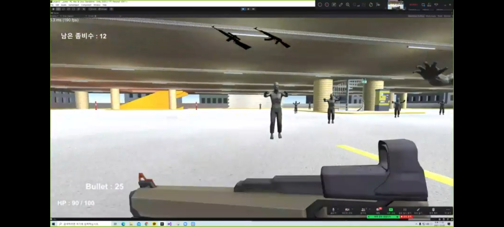
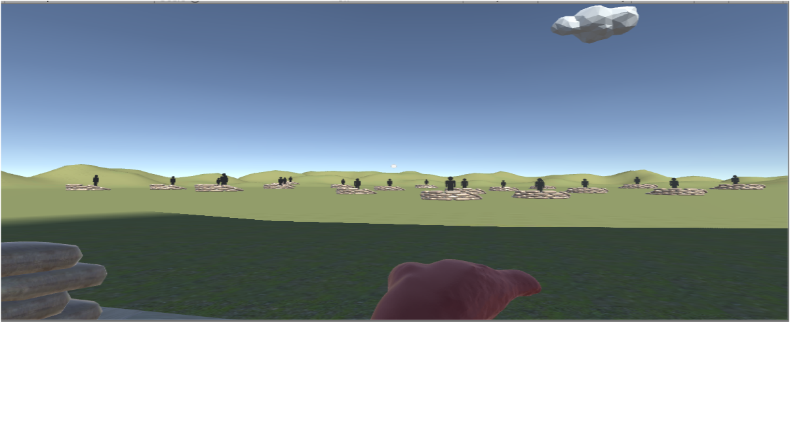

# 한림대학교 빅데이터과 
---
소속 : 소프트웨어융합대학    
전공 : 빅데이터 전공
이름 : 서종오

관심분야   
* 인공지능
* 빅데이터
* 게임제작   

프로그래밍 언어 스킬
1. C
2. java
3. Python
4. C++
5. C#

---------
2022년도 1학기 강의 과목
|과목|학점|
|---|---|
|가상현실기초및실습|3|
|프로그래밍어론|3|
|윈도우프로그래밍|3|
|논리설계및실험|3|
|자료구조|3|
|소프트웨어세미나1|1|

github address:[bell-five][github]

[github]:http://github.com/bell-five

## PROJECTS
----
#### 1. Zombie Game

----
#### 2. spider man Game

---
